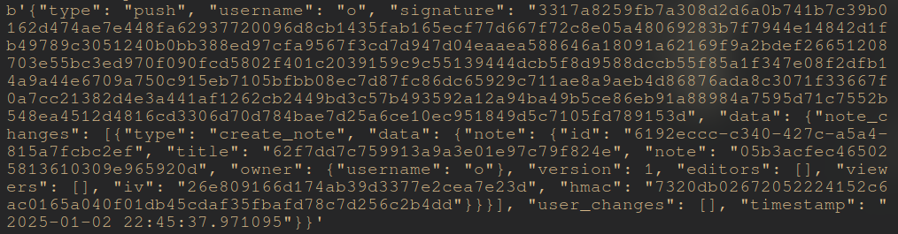
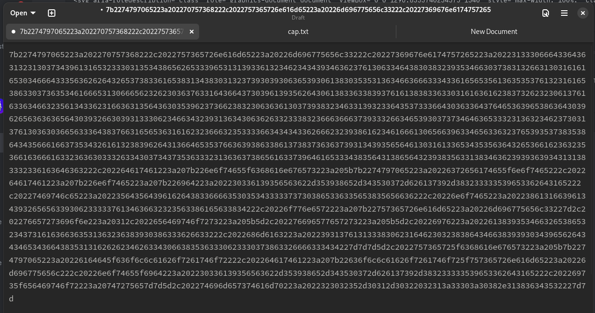
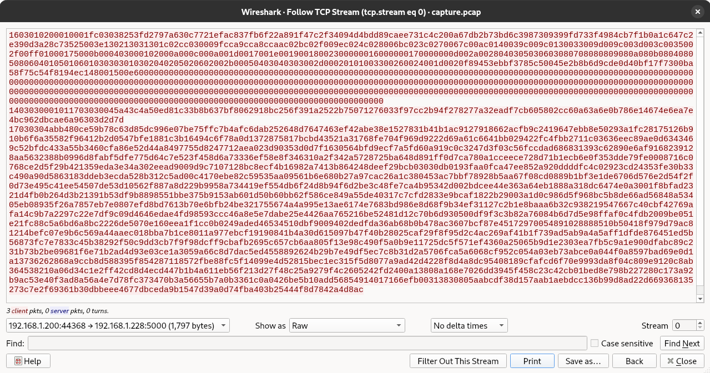
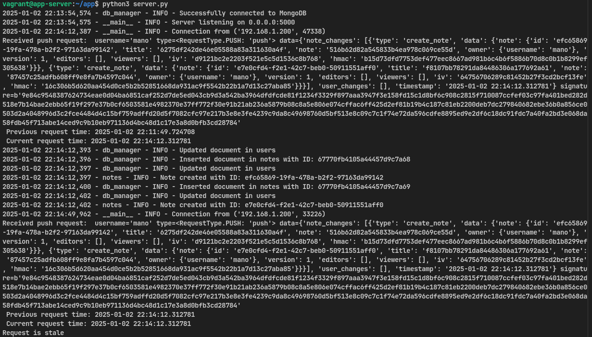
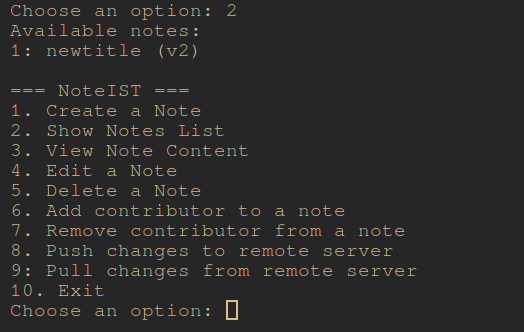
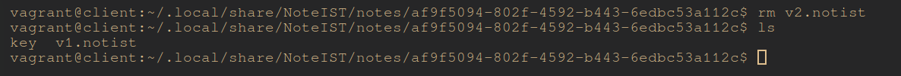
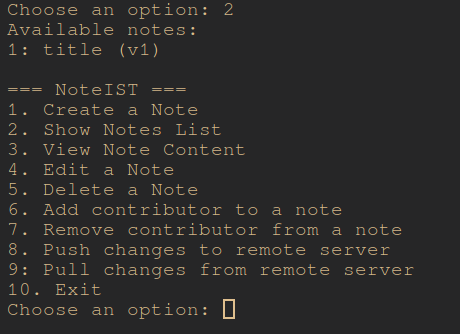
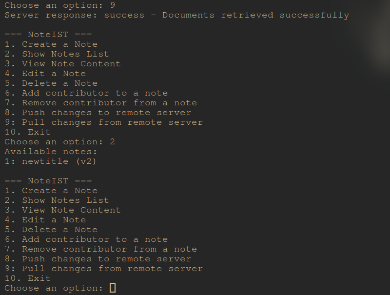

# A62 NotIST Project Read Me

## Team

| Number | Name              | User                             | E-mail                              |
| -------|-------------------|----------------------------------| ------------------------------------|
| 99970  | João Maçãs     | <https://github.com/joaodrmacas>   | <mailto:joaomacas02@tecnico.ulisboa.pt>   |
| 103369  | Miguel Parece      | <https://github.com/BobUser>     | <mailto:miguelparece.ulisboa.pt>     |
| 103708  | Duarte Sao Jose  | <https://github.com/DuarteSJ> | <duarte.s.jose@tecnico.ulisboa.pt> |

  


## Contents

This repository contains documentation and source code for the *Network and Computer Security (SIRS)* project.

The [REPORT](REPORT.md) document provides a detailed overview of the key technical decisions and various components of the implemented project.
It offers insights into the rationale behind these choices, the project's architecture, and the impact of these decisions on the overall functionality and performance of the system.

This document presents installation and demonstration instructions.

## Installation

To see the project in action, it is necessary to setup a virtual environment, with 2 networks and 4 machines.  

The following diagram shows the networks and machines:


*(include a text-based or an image-based diagram)*

### Prerequisites

[Install Vagrant](https://developer.hashicorp.com/vagrant/downloads) on your system.

### Machine configurations

1. Start the virtual machines:
```sh
$ vagrant up
```

2. Check available machines:
```sh
$ vagrant status
```

3. Connect to the desired machine:
```sh
$ vagrant ssh <machine-name>
```

For each machine, there is an initialization script inside of the `scripts` folder with the machine name (prefix `setup_`, suffix `.sh`) that installs necessary packages and configures the clean machine.
**These scripts are run automatically by executing vagrant up**

The Vagrantfile in the repository manages the VM configurations and provisioning.

#### DB Server Machine

This machine runs a [MongoDB](https://www.mongodb.com/) server that provides data storage for the application.

To verify:
```sh
$ mongod --version
$ systemctl status mongod
```

To test:
```sh
$ mongosh --tls \
    --host 192.168.56.17 \
    --tlsCertificateKeyFile /home/vagrant/certs/mongodb/mongodb-server.pem \
    --tlsCAFile /home/vagrant/certs/ca.crt
> use secure_document_db
> db.runCommand({ ping: 1 })
```

The expected results are a successful connection to MongoDB with status code 1.

If you receive the following message "Failed to connect to MongoDB", then:
```sh
$ sudo systemctl start mongod
$ sudo systemctl enable mongod
```

#### App Server Machine

This machine runs a server with a Python socket. It is responsible for handling client requests in a secure manner and ensures network communications with both users and the database.

To verify:
```sh
$ python3 -V
```

To test:
```sh
$ cd app
$ python3 server.py
```

The expected results are the server starting and listening for incoming connections on the 5000 port.

If you receive the message "Address already in use", then:
```sh
$ sudo lsof -i :5000
$ sudo kill <process_id>
```

#### Client Machine

This machine runs a Text User Interface (TUI) application built in Python that allows users to interact with our application.

To verify:
```sh
$ python3 -V  # Verify Python installation
```

To test:
```sh
$ cd /home/vagrant/client/notist_client/src
$ python3 main.py
```

The expected results are a TUI appearing in your terminal where it will tell you that no user was found and ask if you want to create a new account.

If you get a message that looks like `ModuleNotFoundError`, then ensure you have all required Python packages installed by reinstalling all the requirements:
```sh
$ cd /home/vagrant/client/notist_client
$ pip install -r requirements.txt
```
## Demonstration

Now that all the networks and machines are up and running, the following section will show how to use the client and how the requests are being sent between components.

If you followed the instructions above, your client should be displaying the following message.

```
No user found. Proceeding with registration.
ATTENTION- This will overwrite any existing user data.
Would you like to continue? [yes/no]
> yes
Enter your username (must be unique): 
Enter your password: 
```

Make sure to answer yes to the first prompt and then proceed to create the user. At this point, the main menu of the application should appear:

```
=== NoteIST ===
1. Create a Note
2. Show Notes List
3. View Note Content
4. Edit a Note
5. Delete a Note
6. Add contributor to a note
7. Remove contributor from a note
8. Push changes to remote server
9: Pull changes from remote server
10. Exit
Choose an option:
```

These are the functionalities of our program. After registering, all of them except the push and pull from server will be available without internet connection.

### Create Note

To create a note simply press 1 and you will be prompted with the following:

```
Choose an option: 1
Enter note title: ola
Enter note content: ola
```

Locally a directory is createdd on ~/.local/share/NoteIST/notes <note_id> with a key and the following file:

```
{
  "id": "04a34e14-2f3d-4d8b-b631-a30b0712f048",
  "title": "78882c834cd90b65516caa4cd16ef1ec",
  "note": "4037afed5bec821498ee59ffe1c10e4b",
  "owner": {
    "username": "joao"
  },
  "version": 1,
  "editors": [],
  "viewers": [],
  "iv": "33f5c845e79510b1016860e5cea4cc43",
  "hmac": "11eb278f3cae1ba4bc7ffffd6d0a72d27409d53bc35d65761a04c1f0592f7efd"
}
```

As we can see the sensitive information is censored and completely unreadable. The key file in the folder alongside this note **is NOT the key to unencrypt it**, but an encrypted version of said key with the master key derivated from your password.

### Adding Collaborator to Note

To add a collaborator to your note, you will need to know the collaborator username beforehand. When you have this information press 6 on the main menu:

```
Choose an option: 6
Available notes:
1: ola (v1)
Select a note by number: 1
Enter the username of the contributor: miguel
Would you like to give miguel editing permissions to this note, joao? [yes/no]y
```

This adds miguel as a editor to your note, however for him to receive the note, we have to push this changes to the server.

### Pushing changes to the server

Still using the main menu, we will press 8 to send every change to the server. A report of all the changes will be printed for you to know what was successful.

```
Server response: success - Actions processed
{'action': 'create_note', 'status': 'success', 'result': {'status': 'success', 'message': 'Note 04a34e14-2f3d-4d8b-b631-a30b0712f048 created'}}
{'collab': 'add_collaborator', 'status': 'success', 'result': {'status': 'success', 'message': 'Collaborator miguel added to note 04a34e14-2f3d-4d8b-b631-a30b0712f048'}}
```

As we can see, the note creation and adding miguel as a collaborator worked. This means the notes secret key was also encrypted with miguel's public key and sent to the server, which then added it to miguel's representation in the db so that he can receive it when the server sends him the note (this will happens when miguel executes a pul command). When the server receives a note, it will add some metadata to it and send it to the database for it to be stored securely.

#### Pushing changes to the server

Here we can see an example of the data sent through the client socket.



Now we will compare the data sent before entering the socket and the data caught with wireshark.
consider these bytes from a push request with a note creation action.



#### TCP Stream

Consider the stream caught on the Wireshark:



We can identify 5-byte headers that indicate TLS record starts. First byte represents the Record type, second and third bytes represent the TLS version, and the fourth and fifth bytes represent the length of the record. In this Stream we can identify 17 03 03 04 ab Header that means that the record is a TLS 1.3 record with 1195 bytes of length. This is the record that pr contains the message sent by the client to the server. The data following the header is the data sent by the client(encrypted).


### Pull and Show Note

Now switching to the miguel POV we can see that by pressing 9 followed by a 3 and then a 1 on the main menu we get this:

```
Select an option: 9
Server response: success - Documents retrieved successfully

...

Select an option: 3
Available notes:
1: ola (v1)
Select a note by number: 1
Title: ola
Content: ola
```

We can see that Miguel received the note that was encrypted initially without the server or db ever getting access to the sensitive content. This is how the note is represented in the database:

```
{
    _id: ObjectId('67770560239543ab8405e278'),
    id: '04a34e14-2f3d-4d8b-b631-a30b0712f048',
    iv: '33f5c845e79510b1016860e5cea4cc43',
    hmac: '11eb278f3cae1ba4bc7ffffd6d0a72d27409d53bc35d65761a04c1f0592f7efd',
    title: '78882c834cd90b65516caa4cd16ef1ec',
    note: '4037afed5bec821498ee59ffe1c10e4b',
    date_created: ISODate('2025-01-02T21:30:08.098Z'),
    date_modified: ISODate('2025-01-02T21:30:08.098Z'),
    last_modified_by: 'a21b1134-62e9-4533-8ac8-152f69fa7a07',
    version: 1,
    owner: { id: 'a21b1134-62e9-4533-8ac8-152f69fa7a07', username: 'joao' },
    editors: [
      {
        id: '48ad0cc5-1eb4-42af-9b19-217b0dd3dfdd',
        username: 'miguel'
      },
    ],
    viewers: [
      {
        id: '48ad0cc5-1eb4-42af-9b19-217b0dd3dfdd',
        username: 'miguel'
      },
    ]
  }
```

### Attacks

#### Locally tampering with notes title and content

If someone get's access to your computer and changes the content of a note the following will appear when you try to read it

```
An unexpected error occured: Failed to read and decrypt file: Decryption failed. It is likely that your file has been tampered with. Details: non-hexadecimal number found in fromhex() arg at position 33

or 

An unexpected error occured: Failed to read and decrypt file: Decryption failed. It is likely that your file has been tampered with. Details: Padding is incorrect.
```

#### Request replaying

If someone tries to resend a request you have sent in the past, the server will identify that the request was performed by an attacker by using the timestamp. Below we can see a picture of the server receiving 2 exact same requests and identifying that one is stale.



#### Request tampering

If someone catches your request on the network and tries to change any of the data on it, the signature check will fail on the server side and the server will reply with:

```
{"status": "error", "message": "Signature verification failed"}
```

#### Deleting notes

 vOk. Now that we kersionsnow there is no way for anyone to change your notes lets see what happens if someone deletes one of your notes locally.
Here, two things may happen. If you hadn't pushed your changes to the remte server you will permanently loose access to the note, but if your changes were pushed here is what happens:

The user list his notes and sees everything is ok:
o

Someone gains access to the local file system and deletes the last version of the note:


Later, the user lists his notes and sees the last version is missing:


He can just pull from the server and get the note again:



## Additional Information

### Links to Used Tools and Libraries
#### Python Packages

##### Core Python Package/Version Management
- **pip (≥23.0.0)**
  - Documentation: [**pip docs**](https://pip.pypa.io/en/stable/)
  - Repository: [**pypa/pip**](https://github.com/pypa/pip)
  - Package Index: [**pip on PyPI**](https://pypi.org/project/pip/)

- **setuptools (≥65.5.1)**

  - Documentation: [**setuptools docs**](https://setuptools.pypa.io/en/latest/)
  - Repository: [**pypa/setuptools**](https://github.com/pypa/setuptools)
  - Package Index: [**setuptools on PyPI**](https://pypi.org/project/setuptools/)

- **wheel (≥0.40.0)** 

  - Documentation: [**wheel docs**](https://wheel.readthedocs.io/en/stable/)
  - Repository: [**pypa/wheel**](https://github.com/pypa/wheel)
  - Package Index: [**wheel on PyPI**](https://pypi.org/project/wheel/)

##### Security and Cryptography
- **cryptography (==3.4.7)**
  - Documentation: [**cryptography docs**](https://cryptography.io/en/3.4.7/)
  - Repository: [**pyca/cryptography**](https://github.com/pyca/cryptography)
  - Package Index: [**cryptography on PyPI**](https://pypi.org/project/cryptography/3.4.7/)

- **pycryptodome (==3.21.0)**
  - Documentation: [**pycryptodome docs**](https://pycryptodome.readthedocs.io/)
  - Repository: [**Legrandin/pycryptodome**](https://github.com/Legrandin/pycryptodome)
  - Package Index: [**pycryptodome on PyPI**](https://pypi.org/project/pycryptodome/3.21.0/)

##### Data Validation and Metadata
- **pydantic (==2.10.4)**
  - Documentation: [**pydantic docs**](https://docs.pydantic.dev/2.10/)
  - Repository: [**pydantic/pydantic**](https://github.com/pydantic/pydantic)
  - Package Index: [**pydantic on PyPI**](https://pypi.org/project/pydantic/2.10.4/)

- **importlib_metadata (≥4.13.0)**
  - Documentation: [**importlib_metadata docs**](https://importlib-metadata.readthedocs.io/)
  - Repository: [**python/importlib_metadata**](https://github.com/python/importlib_metadata)
  - Package Index: [**importlib_metadata on PyPI**](https://pypi.org/project/importlib-metadata/)

#### Development and Virtual Environments
- **vagrant**
  - Documentation: [**vagrant docs**](https://developer.hashicorp.com/vagrant/docs)
  - Repository: [**hashicorp/vagrant**](https://github.com/hashicorp/vagrant)
  - Download: [**vagrant downloads**](https://developer.hashicorp.com/vagrant/downloads)

### License
This project is licensed under the MIT License - see the [LICENSE.txt](LICENSE.txt) for details.

