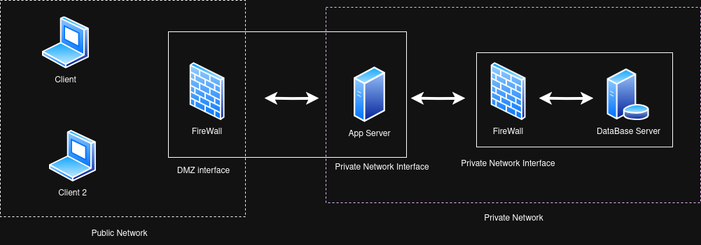

# A62 NotIST Project Read Me

## Team

| Number | Name              | User                             | E-mail                              |
| -------|-------------------|----------------------------------| ------------------------------------|
| 99970  | João Maçãs     | <https://github.com/joaodrmacas>   | <mailto:joaomacas02@tecnico.ulisboa.pt>   |
| 103369  | Miguel Parece      | <https://github.com/BobUser>     | <mailto:miguelparece.ulisboa.pt>     |
| 103708  | Duarte Sao Jose  | <https://github.com/DuarteSJ> | <duarte.s.jose@tecnico.ulisboa.pt> |

  


## Contents

This repository contains documentation and source code for the *Network and Computer Security (SIRS)* project.

The [REPORT](REPORT.md) document provides a detailed overview of the key technical decisions and various components of the implemented project.
It offers insights into the rationale behind these choices, the project's architecture, and the impact of these decisions on the overall functionality and performance of the system.

This document presents installation and demonstration instructions.

## Installation

To see the project in action, it is necessary to setup a virtual environment, with 2 networks and 4 machines.  

The following diagram shows the networks and machines:



*(include a text-based or an image-based diagram)*

### Prerequisites

Install Vagrant on your system: https://developer.hashicorp.com/vagrant/downloads

### Machine configurations

1. Start the virtual machines:
```sh
$ vagrant up
```

2 Check available machines:
```sh
$ vagrant status
```

3. Connect to the desired machine:
```sh
$ vagrant ssh <machine-name>
```

For each machine, there is an initialization script with the machine name (prefix `setup-`, suffix `.sh`) that installs necessary packages and configures the clean machine.
**These scripts are run automatically by executing vagrant up**

The Vagrantfile in the repository manages the VM configurations and provisioning.

#### DB Server Machine

This machine runs a MongoDB server that provides data storage for the application.

To verify:
```sh
$ mongod --version
$ systemctl status mongod
```

To test:
```sh
$ mongosh --tls \
    --host 192.168.56.17 \
    --tlsCertificateKeyFile /home/vagrant/certs/mongodb/mongodb-server.pem \
    --tlsCAFile /home/vagrant/certs/ca.crt
> use secure_document_db
> db.runCommand({ ping: 1 })
```

The expected results are a successful connection to MongoDB with status code 1.

If you receive the following message "Failed to connect to MongoDB", then:
```sh
$ sudo systemctl start mongod
$ sudo systemctl enable mongod
```

#### App Server Machine

This machine runs a Python socket server handling network communications with both users and the database.

To verify:
```sh
$ python3 -V
```

To test:
```sh
$ cd app
$ python3 server.py
```

The expected results are the server starting and listening for incoming connections on the 5000 port.

If you receive the message "Address already in use", then:
```sh
$ sudo lsof -i :5000
$ sudo kill <process_id>
```

#### Client Machine

This machine runs a Text User Interface (TUI) application built in Python that allows users to interact with our application.

To verify:
```sh
$ python3 -V  # Verify Python installation
```

To test:
```sh
$ notist-client #start the TUI
```

The expected results are a TUI interface appearing in your terminal where it will tell you that no user was found and if you want to create a 

If you receive the following message "ModuleNotFoundError", then ensure you have all required Python packages installed:
```sh
$ cd client/notist_client/src
$ pip install -r requirements.txt
```
TODO:
## Demonstration

Now that all the networks and machines are up and running, ...

*(give a tour of the best features of the application; add screenshots when relevant)*

```sh
$ demo command
```

*(replace with actual commands)*

*(IMPORTANT: show evidence of the security mechanisms in action; show message payloads, print relevant messages, perform simulated attacks to show the defenses in action, etc.)*

This concludes the demonstration.

## Additional Information

### Links to Used Tools and Libraries

- [Java 11.0.16.1](https://openjdk.java.net/)
- [Maven 3.9.5](https://maven.apache.org/)
- ...

### Versioning

We use [SemVer](http://semver.org/) for versioning.

### License

This project is licensed under the MIT License - see the [LICENSE.txt](LICENSE.txt) for details.

*(switch to another license, or no license, as you see fit)*

----
END OF README
