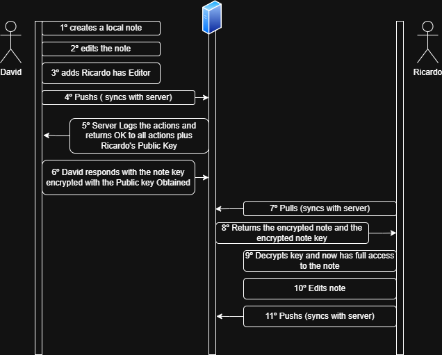

# A62 Notist Project Report

## 1. Introduction

NotIST is a secure note-taking application designed with a "local-first" architecture, prioritizing user privacy and data security while enabling collaborative features. The application allows users to create, manage, and share notes with other users, with all data being encrypted both locally and during synchronization with the backup server without ever exposing sensitive information.

### 1.1 Business Scenario
The project addresses the growing need for secure, private note-taking solutions in an increasingly interconnected digital world. Users require a platform that maintains the convenience of modern note-taking apps while ensuring their personal data remains protected and private. NotIST achieves this by implementing strong encryption mechanisms that ensure notes are only accessible to their rightful owners and authorized collaborators.

### 1.2 Main Components

#### 1.2.1 Secure Documents
#TODO: change this to text
- Notes are stored as JSON documents containing metadata and content
- Sensitive information (note and title) of the notes are kept encrypted
- Document structure includes ownership information, access controls, and version tracking
- Support for different access levels (owners, editors, viewers)

#### 1.2.2 Infrastructure
The system consists of three main components:
- Client Application: A Python-based TUI (Terminal User Interface) for user interactions
- Application Server: A Python socket server handling communication and business logic
- Database Server: A MongoDB instance storing encrypted notes and user data

#### 1.2.3 Security Challenge
Security challenge A was the one chosen for our implementation which involves implementing secure note sharing while maintaining:
- End-to-end encryption for personal and shared notes
- Access control mechanisms for both viewers and editors
- Version control with integrity verification for owner and collaborators
- Authentication and authorization systems

### 1.3 Assumptions

make an assumptions page on the introduction. We did some assumption to simplify the business logic of the program.
- destructive pull (everything no pushed will be destroyed on pull)
- a user will only access from one computer
- if the user loses private key he can't recover it


#TODO:
(_Include a structural diagram, in UML or other standard notation._)

## 2. Project Development

### 2.1. Secure Document Format

### 2.1.1 Design

The cryptographic library for NotIST was designed to meet the requirements of secure note storage and sharing. It provides several high-level methods that secure encryption, decryption, and integrity checks, both for files and raw JSON data.
The library was designed to provide the following protection to the files:
- **[SR1: Confidentiality]** Only the owner of the notes can see their content.
- **[SR2: Integrity 1]** The owner of the notes can verify they were not tampered with.
- **[SR3: Integrity 2]** The owner of the notes can verify if any note is missing.
- **[SR4: Authentication]** Only the owner of the notes can access them.

**Library Methods Provided:**

1. **CLI Commands**:
   - `protect`: Encrypts a file, adds integrity protection, and saves the result as an encrypted JSON file.
   - `unprotect`: Decrypts a protected file and verifies its integrity.
   - `check-single`: Verifies the integrity of a single file by comparing its HMAC.
   - `check-multiple`: Checks the integrity of multiple files in a directory against a provided digest of the sum of file's HMACs.

2. **Programmatic Methods**:
   - `protect(json_data, key, output_file)`: Encrypts and protects JSON data directly, allowing seamless integration into the NotIST app.
   - `unprotect(input_file, key)`: Decrypts and verifies integrity for JSON data, returning the original content.
   - `checkSingleFile(file, key_file)`: Verifies the integrity of a single encrypted file by checking its HMAC.
   - `checkMissingFiles(directoryPath, digestOfHmacs)`: Checks the integrity of multiple files in a directory against a digest of concatenated HMACs.
   - `protect_file(input_file, key_file, output_file)`: Protects a file by encrypting and adding integrity protection.
   - `unprotect_to_file(input_file, key_file, output_file)`: Decrypts a protected file, verifies its integrity, and saves the output as a plain JSON file
   

**Encryption and Integrity Features:**

AES in CBC mode is used to encrypt sensitive fields (`title` and `note`), since we focused on a reliable confidentiality and handled the integrity separetely by using HMAC (SHA-256) for tampering detection or corruption. The library stores the fields "hmac" and "iv" in the note file to be able to unencrypt and check changes on the file later.

**File Structure:**

Encrypted files include metadata such as IV and HMAC, sensitive encrypted data (note and title) and non-sensitive unencrypted data. The unencrypted data is mainly used for client-side information display. Below is an example of how the notes are being stored:

**Example JSON Format (Encrypted):**

```json
{
    "id": "69444617-03cd-40c9-88a7-b00106cae2cb",
    "iv": "305cc94e5afb2b17e4369f47e7cad6e2",
    "hmac": "542fca04ab5f5d98d32d6f4bf90d712c8dda6cbf9f5a0b393c8eec1cdaa087a0",
    "title": "5de2069ca85b23a4e17eb8fb5978db1e",
    "note": "39c77fe29eefabd713dfca9167099737",
    "date_created": "2025-01-01T19:11:26.077000",
    "date_modified": "2025-01-01T19:12:05.734000",
    "last_modified_by": "de319afa-060c-4e20-ad04-ce184ce1e8e9",
    "version": 3,
    "owner": {
        "id": "de319afa-060c-4e20-ad04-ce184ce1e8e9",
        "username": "la"
    },
    "editors": [
        {
            "id": "26b22be0-addc-411e-8bd5-d02ca195e4b5",
            "username": "alo"
        }
    ],
    "viewers": [
        {
            "id": "26b22be0-addc-411e-8bd5-d02ca195e4b5",
            "username": "alo"
        }
    ]
}
```

---

### 2.1.2 Implementation

The library was implemented in **Python**, using the `PyCryptodome` library for cryptographic operations.

**Implementation Steps:**

1. **Encryption**:
   - Files are parsed to extract sensitive fields (title and note).
   - Sensitive fields are encrypted using AES-CBC with a randomly generated IV.
   - Sensible encrypted data will be concatenated and computed in order to generate and hmac.
   - The hmac and the randomly generated IV is stored in the file.

2. **Decryption and Verification**:
   - The encrypted sensible fields are concatenated and the hmac of them is computed. 
   - The computed hmac is compared to the stored file hmac to check integrity.
   - If the integrity check passes means there was no tampering and encrypted fields are decrypted.

**Challenges and Solutions**:
#TODO:
Talvez dizer que nao nos conseguiamos decidir no algoritmo a usar

1. **Challenge**: Handling missing fields or corrupted files.
   - **Solution**: Validation checks and exception handling were added to identify and handle malformed inputs gracefully.
2. **Challenge**: Key management during encryption and decryption.
   - **Solution**: Keys are stored separately, and a secure key parsing method ensures compatibility across operations.


**Example of Library Usage:**

- **Encrypting a File**:
  ```bash
  secure-document protect input.json keyfile output.json
  ```
- **Verifying Integrity**:
  ```bash
  secure-document check-single encrypted.json keyfile
  ```


### 2.2. Infrastructure  

#### 2.2.1. Network and Machine Setup  

To streamline machine provisioning, we chose **Vagrant** for its ability to efficiently deploy all virtual machines simultaneously. Vagrant allows us to automatically execute setup scripts during provisioning, enabling a complete environment—virtual machines and software stack—with a single **`vagrant up`** command.  

The **Vagrantfile** simplifies the configuration of network interfaces and shared folders, allowing for quick customization with minimal effort.  

- **Client/Client2** (Simulated clients):  
  - Operating System: **Ubuntu 20.04 LTS**  
  - Network Interfaces:  
    - Public Interface: *(to be specified)*  

- **AppServer** (Application Server):  
  - Operating System: **Ubuntu 20.04 LTS**  
  - Network Interfaces:  
    - **Public DMZ Interface**: **192.168.1.228** (accessible from the internet)  
    - **Private Interface**: **192.168.56.14** (used for database communication)  
  - **Firewall Rules**:  
    - Allow incoming connections on port **5000**  
    - Block all other traffic  

- **DBServer** (Database Server):  
  - Operating System: **Ubuntu 20.04 LTS**  
  - Network Interfaces:  
    - **Private Interface**: **192.168.56.17** (used for secure communication with the AppServer)  
  - **Firewall Rules**:  
    - Allow incoming connections on port **27017**  
    - Block all other traffic  

#### 2.2.2. Server Communication Security  

- **Client ↔ AppServer Communication**:  
  - Communication between the client and the AppServer is secured using **TLS**.  
  - The client possesses the CA certificate that signed the AppServer's certificate, allowing it to verify the server's identity.  
  - This setup ensures secure, encrypted communication and guarantees the client is interacting with the correct server.  

- **AppServer ↔ DBServer Communication**:  
  - Communication between the AppServer and DBServer is secured using **mutual TLS (mTLS)**.  
  - Both the AppServer and DBServer have certificates signed by the same CA and possess the CA certificate, enabling them to verify each other's identity.  
  - This setup ensures both endpoints are authenticated, and the communication is fully encrypted.


### 2.3. Security Challenge

#### 2.3.1. Challenge Overview

#TODO: explicar os tipos de chaves que tivemos de criar (a master key ja iamos precisar para o secure documents)

The users of NotIST want to share their notes with anyone on the web. To achieve this, the required functionality must ensure secure note sharing while meeting the following security requirements:

- **[SRA1: Authentication]** Only authenticated and authorized users can see the content of the notes.
- **[SRA2: Integrity 1]** Anyone that has access to the note can verify its integrity.
- **[SRA3: Integrity 2]** It is possible to verify the integrity of the notes throughout their versions.

(Security challenge A)

#### Impact on the Original Design

To address these requirements, we had to refactor our program, particularly the way authentication and integrity were handled. Initially, the system used a **username and password** for login, followed by a session token for subsequent requests. While this method provided basic authentication, it lacked the cryptographic rigor required for secure note sharing.

Given the need for sharing encrypted files, which required the use of key pairs, we implemented the following changes:

- Replaced the previous username-password login system with an authentication mechanism that uses **signed requests**. Each request is signed with the user's private key and includes a **timestamp**. This by itself guarantees authentication (only registered users will pass the signature check) and integrity (only untampered data requests will pass the signature check and only fresh requests will pass the timestamp check). 
- The versioning of the notes was kept the same with the introduced challenge because we consider one symmetric key for each note and all their versions.

These changes not only meet the requirements of the security challenge but also enhance the overall security of the system by ensuring strong cryptographic guarantees for authentication and integrity.


#### 2.3.2. Attacker Model

**Trust Levels**

*Fully Trusted*:
- Client-side application when running on user's machine
- User's private key and local master key
- Database Server (DBServer)
  - Stores and maintains integrity of users' public keys
  - Critical for the security of note sharing

*Partially Trusted*:
- Application Server (AppServer)
  - Trusted for authentication and message delivery
  - Not trusted with note contents or keys
  - Responsible for enforcing access control and versioning

*Untrusted*:
- Network communications (protected by TLS)
- Other users' machines
- Stored encrypted data on disk
- Other users (even those with legitimate access to shared notes)

TODO: REVER ISTO?
**Attacker Capabilities**

The attacker is assumed to have the following capabilities:
- Full network access (can intercept, modify, or inject network traffic)
- Ability to attempt replay attacks on API endpoints
- Access to encrypted data stored on disk
- Ability to attempt impersonation of users
- Ability to register as a legitimate user
- Access to shared notes they are legitimately given access to

**Attacker Limitations**

The attacker cannot:
- Compromise the database server (this would break the public key infrastructure)
- Access users' private keys TODO: pode ter acesso a private key desde que nao saiba a password? Mas ao mesmo tempo com a private key consegue mandar requests para o server que vao ser aceites
- Derive the master key without knowing the user's password
- Decrypt note contents without the corresponding note key
- Forge valid signatures without the private key
- Successfully replay requests due to timestamp verification
- Access plain text of sensitive note data (title and content) on the servers
- Have access to the certificate authority (CA) private key or the dbserver and appserver private keys
**Security Guarantees**

Against this attacker model, our system provides:
1. **Confidentiality**: 
   - Note contents remain encrypted at rest and in transit
   - Note keys are securely shared using public key encryption
   - Local notes are protected by the master key

2. **Integrity**: 
   - All requests are signed with user's private key
   - Note versions are controlled server-side
   - Tampering with encrypted data is detectable

3. **Authentication**:
   - All operations are signed with user's private key
   - Timestamp verification prevents replay attacks
   - Server maintains last request time for freshness

4. **Access Control**:
   - Note keys are only shared with authorized collaborators
   - Each collaborator receives their own encrypted copy of the note key
   - Server controls authorization lists for each note (only sends to the current collaborators)

<!-- **Future Security Enhancements**

To strengthen the security model, the following improvements could be considered:
1. **Public Key Verification**:
   - Implement a certificate authority (CA) system to sign user public keys
   - Add key rotation mechanisms for periodic key updates
   - Create a public key verification system using blockchain or a transparency log

2. **Database Security**:
   - Implement additional integrity checks for stored public keys
   - Add digital signatures to public key records
   - Create a backup verification system for public keys

3. **Access Control**:
   - Add capability to revoke access to shared notes
   - Implement fine-grained permissions for shared notes
   - Add audit logging for all sharing operations -->

#### 2.3.3. Solution Design and Implementation

To meet the security challenge, the solution was redesigned to the following:

#### Local Security
Given that this is a local-first application, we implemented some measures to protect notes if an attacker gains access to the user's computer.

- **Master Key**:  
  The master key is derived from the user’s password using a Password-Based Key Derivation using SHA-256 algorithm and a unique salt. 
  The master key is stored only in memory and is used to encrypt the symmetric keys of the notes.

- **Encrypted Note Keys**:  
  Encrypted note keys are saved locally. This ensures that even if local files are accessed, the keys remain secure.  

- **Password Prompt on Startup**:  
  When the client is launched, the user must enter their password to regenerate the master key and decrypt the note keys.

This way we can guarantee that even if the user's computer is compromised he won't be able to see the notes unless he also has access to the user's password.

**Storage and Trust Model for Keys:**  
- **Private Key of User**: Stored securely on the client side and protected by the user's master key.  TODO: ???
- **Public Key of User**: Stored on the server, accessible for key-sharing operations.  
- **Note Key**: Stored on the client, encrypted using the local master key for protection.  
- **Master Key**: Stored only in the memory of the client, derived from the user’s password and a salt. 

**Trust Model for the Servers:**  
The AppServer and DBServer are treated as untrusted entities regarding note content. Sensitive data (note title and content) remains encrypted throughout all operations. This ensures end-to-end encryption where only the client can decrypt the content.

**Authentication and Request Handling:**  
- Requests are authenticated using the user’s private key, with each request digitally signed to ensure integrity and non-repudiation.  
- A timestamp mechanism is incorporated into requests to prevent replay attacks. The server maintains the last request time for freshness checks.  

**Key Management for Shared Notes:**  
When a user shares a note, the following sequence occurs:  
1. The client fetches the public key of the collaborator from the server.  
2. The client encrypts the note’s symmetric key (used to encrypt the note content) with the collaborator's public key.  
3. The encrypted note key is sent to the server and stored in the collaborator's database record.  
4. When the collaborator pulls the note, they decrypt the note key using their private key to access the content.  

**Note Versioning:**  
The server is responsible for maintaining note versions. When multiple collaborators make edits:  
1. Each update from a client is treated as a new version of the note.  
2. The server increments the version number sequentially.  
3. Integrity of versions is ensured by verifying signatures and maintaining an immutable history of changes.  

#### Collaborator Removal

To handle the removal of a collaborator from a shared note, the system implements the following mechanism:

- **Key Retention**:  
  The note's symmetric key is not re-encrypted or changed when a collaborator is removed. This avoids unnecessary disruptions for the remaining collaborators.

- **Server Validation**:  
  The server enforces access control, validating who has permission to access the note. When a removed collaborator attempts to pull the note, the server denies access, ensuring they no longer receive updates.  

- **Local Key Deletion**:  
  On the next synchronization, the removed collaborator’s client automatically deletes the locally stored encrypted note key. Without the key, the removed collaborator can no longer decrypt or access the note content.

This implementation doesn't stop old collaborators to have access to the older versions if they make a local copy. However, we don't think this is preventable.


**Communication Diagram:**  




## 3. Conclusion

## 3. Conclusion

### Main Achievements

Our implementation of NotIST successfully delivered a secure, local-first note-taking application that prioritizes both security and collaboration. The key achievements include:
- Implementation of end-to-end encryption for notes using AES-CBC
- Development of a robust public key infrastructure for secure note sharing
- Creation of a multi-layered security architecture combining local security (master key) with distributed security (note keys)
- Implementation of a secure version control system that maintains integrity across collaborative edits

### Requirements Analysis

All specified requirements were successfully satisfied:

**Secure Documents Requirements:**
- **[SR1: Confidentiality]** ✓ Satisfied through AES encryption of sensitive note content and secure key management. Only owners can access note content through their master key and note key.
- **[SR2: Integrity 1]** ✓ Satisfied using HMAC-SHA256 for tamper detection of individual notes.
- **[SR3: Integrity 2]** ✓ Satisfied through the implementation of a digest generated by concatenating all notes hmacs and comparing to the server's
- **[SR4: Authentication]** ✓ Satisfied via the master key derived from the user's password to unencrypt both the user's private key and notes' keys, ensuring only owners can access their notes.

**Security Challenge A Requirements:**
- **[SRA1: Authentication]** ✓ Satisfied through a combination of public key cryptography and signed requests with timestamp verification.
- **[SRA2: Integrity 1]** ✓ Satisfied by extending the HMAC verification system to all users with note access.
- **[SRA3: Integrity 2]** ✓ Satisfied through server-side version control and by using the same symmetric key across all note versions.

### Future Enhancements

Several potential improvements could further enhance the system:
1. **Key Rotation Mechanism**: Implement periodic key rotation for both user keys and note keys to improve long-term security.
2. **Advanced Access Control**: Develop more granular permissions and the ability to securely revoke access with automatic key re-encryption.

### Conclusion

The development of NotIST demonstrated that it's possible to create a secure focused, local-first architecture application that maintains the benefit of note sharing. The project helped us understand how the different cryptographic services can be used to meet modern day security requirements. Along the project we swapped multiple times how the security needs were being handled since we would constantly think of better ways to do them and this provided us with insights of not only concepts that we implemented (digital signatures, hmac, etc...) but also the ones we tried to make work (sessions authentication, key revocation, etc...) until we reached this final concept.
The project provided valuable insights into the challenges of building secure systems, particularly in balancing security requirements with user experience and performance considerations.

## 4. Bibliography

(_Present bibliographic references, with clickable links. Always include at least the authors, title, "where published", and year._)

----
END OF REPORT
